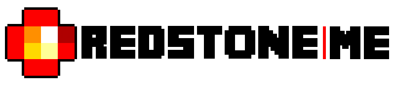

<h1  align="center">
     
</h1>

<h2  align="center">
      
    
    
    
    
</h2>

## Description
Activate redstone just with your presence !

Java Edition required. RedstoneMe is mainly compatible with Bukkit, Spigot and Paper.

## Project page
+ https://dev.bukkit.org/projects/redstoneme
+ https://www.curseforge.com/minecraft/bukkit-plugins/redstoneme
